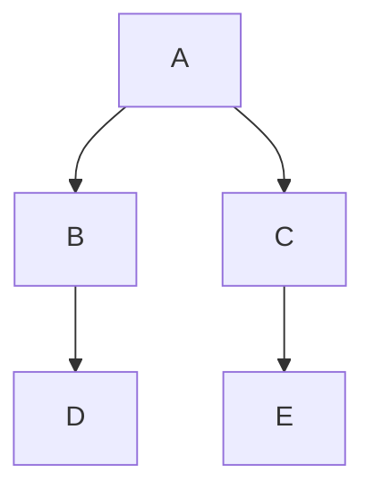
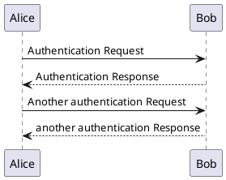

## Previm

 

Vim 预览插件。

### 截图

## 支持的文件格式

* Markdown
    * [CommonMark](http://commonmark.org/)
    * [PHP markdown 额外风格缩写](https://github.com/markdown-it/markdown-it-abbr)
    * [Pandoc 风格定义列表](https://github.com/markdown-it/markdown-it-deflist)
    * [Pandoc 风格脚注](https://github.com/markdown-it/markdown-it-footnote)
    * [Pandoc 风格下标](https://github.com/markdown-it/markdown-it-sub)
    * [Pandoc 风格上标](https://github.com/markdown-it/markdown-it-sup)
    * [东亚换行符](https://github.com/markdown-it/markdown-it-cjk-breaks)
    * [mermaid](http://knsv.github.io/mermaid/index.html)
    * [PlantUML](https://github.com/plantuml/plantuml)
* reStructuredText（需要 rst2html.py）
* textile
* AsciiDoc

## 依赖

### 用于转换

textile 和 Markdown 的情况下无需任何必要的库。  
reStructuredText 的情况下需要 `rst2html.py`。  
安装 `docutils` 时，`rst2html.py` 命令将变为可用。

    % pip install docutils
    % rst2html.py --version
    rst2html.py (Docutils 0.12 [release], Python 2.7.5, on darwin)

### 打开预览

无需额外的库或插件。

但是，它可以与 [open-browser.vim](https://github.com/tyru/open-browser.vim) 集成。有关详细用法，请参见下文。

## 使用方法

1. 在 .vimrc 中定义 `g:previm_open_cmd`
    * 此命令在终端中用于打开浏览器。
    * 例如，在 Mac 上使用 Safari `let g:previm_open_cmd = 'open -a Safari'`
    * 使用 `:help g:previm_open_cmd` 获取更多详情
    * 如果使用 open-browser，可以跳过此设置。
2. 开始编辑 Markdown 文件（`filetype` 为 `markdown`）
3. 运行 `:PrevimOpen` 打开浏览器进行预览
4. 返回 Vim 编辑文件
5. 更新文件，预览内容将自动更新

使用 Safari 13.0.3 有一个问题，页面转换在"加载中..."后停止。

需要进行以下设置以使 previm 在 Safari 上工作。

1. Safari > 偏好设置 > 高级 > 在菜单栏中勾选"显示开发者菜单"
2. 开发 > 禁用本地文件限制

### mermaid

支持 [mermaid](http://knsv.github.io/mermaid/)

<pre>

</pre>

### PlantUML

支持 [PlantUML](https://github.com/plantuml/plantuml)。

<pre>

</pre>

